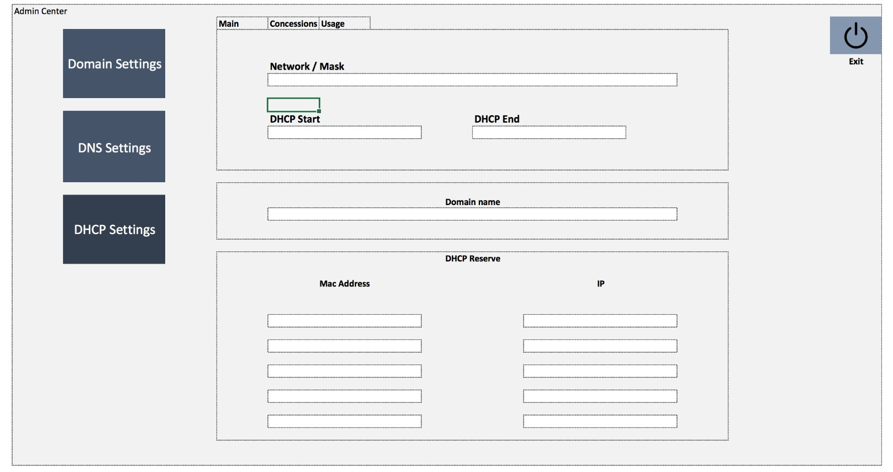
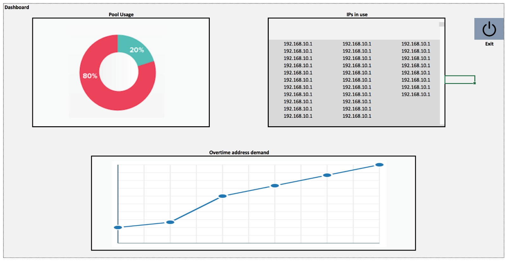

# Projeto DW - dhcp-admin

## Equipe:
* André Henrique Sousa de Menezes - 20131380324
* Igor de Sousa Dantas - 20131380120

## Descrição do Projeto:

O projeto consiste na criação de uma interface web para gerenciar o software isc-dhcp-server.
A iterface, chamada de webdhcp-admin, poderá ser acessada por 2 tipos de usuários: admin e user. 
Sendo o usuário admin aquele responsável pelas seguintes configurações do serviço DHCP:
* Configurações de domínio;
* Configurações de dns;
* Tempo de empréstimo padrão;
* Tempo máximo de empréstimo;
* Escopo DHCP.

Todas as configurações serão feitas na página dashboard admin.
A segunda página principal é a dashboard user, ambos admin e user terão acesso a página que irá dispor de informações relacionadas ao serviço dhcp:
* Vizualização das configurações;
* Vizualiação de gráficos:
  - Consumo do dhcp;
  - IPs concedidos;
  - Gráfico de emprestimo/tempo;

## O projeto se baseia nos seguintes templates:

## Esboço:

## Requisitos mínimos

  > Conexão com a internet (Apenas durante instalação de máquina virtual);
  > Vagrant 1.7.4 ou superior instalado;
  > Ambiente de virtualização compatível com versão 1.7.4 do Vagrant (O VirtualBox foi utilizado para este sistema);
  > Versão mais atual do web browser Google Chrome, Mozilla Firefox ou Safari.

## Getting started

  > Para utilizar o sistema desenvolvido é necessário executar os passos a seguir:

    1. Criar um diretório em local de sua preferência:

    2. Dentro do diretório clonar o repositório:
        # https://github.com/menezescode/dhcp-admin.git

    3. Acessar o diretório onde se encontra o arquivo de instalação da máquina virtual
    que servirá o ambiente web (Vagrantfile):
        # cd dhcp-admin/vagrant/VagrantServer/

    4. Executar o comando a seguir e aguardar o fim da instalação (interação com processo poderá ser necessária):
        # vagrant up

    5. Acessar a máquina virtual dhcpserver e inciar o serviço DHCP:
    Obs:. Será necessário desconectar-se de sua rede local para que não haja conflito entre os serviços
    DHCP da máquina virtual e de seu roteador.

        # vagrant ssh dhcpserver
        # sudo service isc-dhcp-server start
        # quit

    6. Verificar status / recarregar máquina cliente:

        # vagrant global-status

        >Verificar status da máquina cliente 'dhcpclient'
          > Caso o status esteja diferente de 'running' executar o comando:
            # vagrant reload dhcpclient

    7. Acessar máquina cliente e solicitar novo "lease" ao servidor DHCP:

        # vagrant ssh dhcpclient
        # sudo dhclient -r && sudo dhclient

    8. Pronto! Agora é só brincar!
